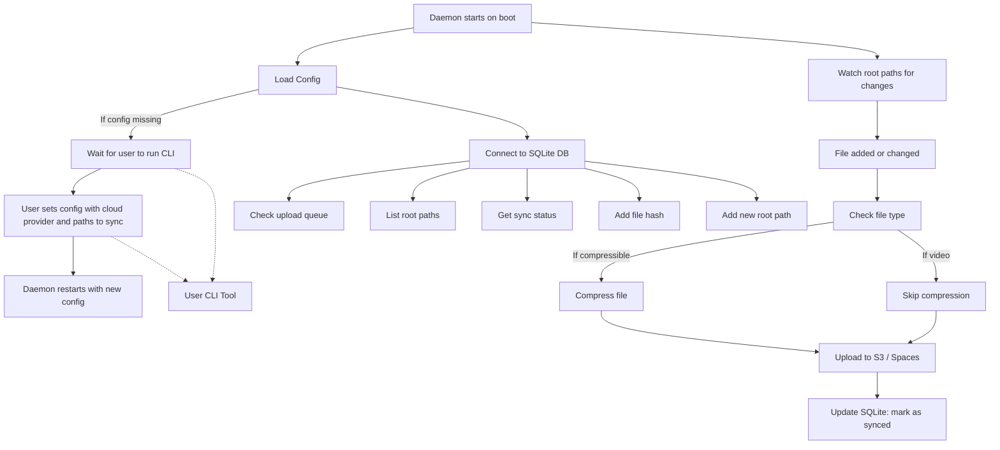

# tanaka
Background daemon to backup your files to a cloud provider


Purpose
config/
Load/save daemon config (S3/Spaces choice, watched paths)
cli/
Code for CLI commands (e.g. add, remove, status)
core/
Main daemon logic (startup, loop, scheduling)
db/
Abstracts interaction with SQLite (sync state, queue)
storage/
Upload code for S3 and Spaces + file compression logic
watcher/
Handles inotify or FSEvents/etc. to watch files
utils/
Generic utilities: logging, hashing (SHA256, etc.)
data/
Stores runtime data: config file, local DB, state files
main.cpp
Initializes and runs the daemon (calls into core)





To Build
```
rm -rf build
cmake -B build -S . -DBUILD_TESTING=OFF
cmake --build build
```

To Test
```
rm -rf build
cmake -B build -S . -DBUILD_TESTING=ON
cmake --build build
ctest --output-on-failure
```
